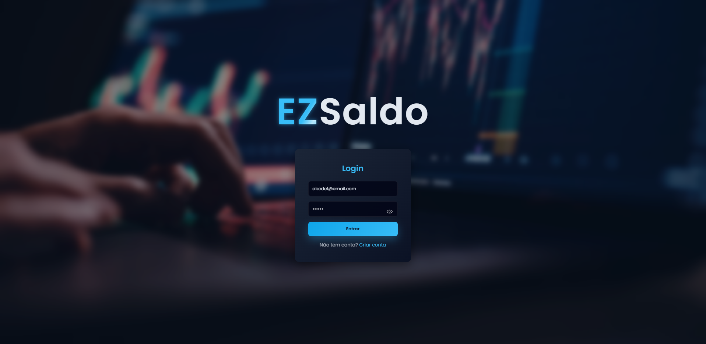
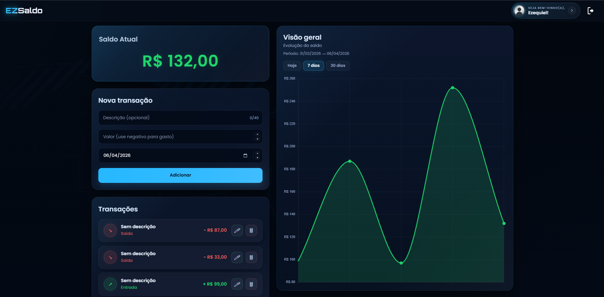
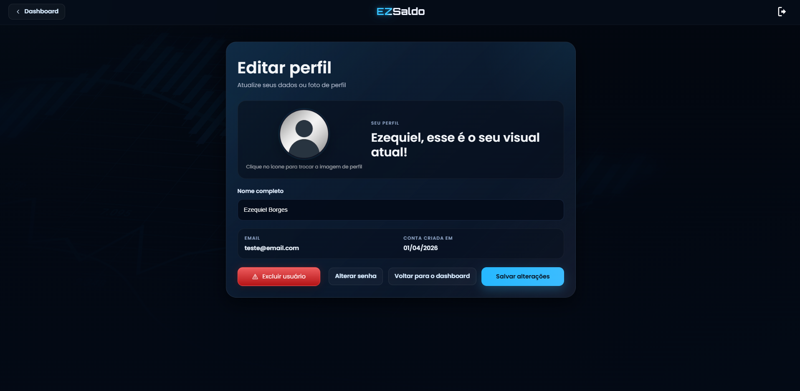
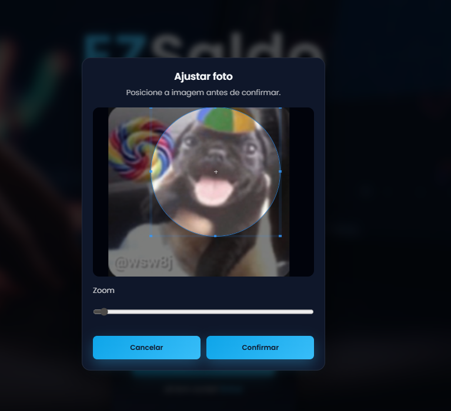

> ⚠️ **Status do Projeto:** Em desenvolvimento (atualmente rodando localmente)

# 💰 EZSaldo • Sistema Financeiro Web


O **EZSaldo** é uma aplicação web de controle financeiro desenvolvida com foco em **clareza, organização e experiência do usuário**.

O sistema permite gerenciar receitas e despesas, acompanhar o saldo em tempo real e visualizar a evolução financeira através de um dashboard moderno e interativo.

---

## 🎯 Objetivo do Projeto

Este projeto foi desenvolvido com o objetivo de:

- Simular um sistema financeiro real
- Praticar desenvolvimento fullstack (frontend + backend)
- Aplicar conceitos de UX/UI em um produto funcional
- Criar um projeto sólido para portfólio

---

## 📸 Preview

Interface moderna com foco em experiência do usuário:

### 🔐 Tela de Login


### 📊 Dashboard Financeiro


### 👤 Edição de Perfil


### ✂️ Recorte de Avatar


---

## 🛠️ Tecnologias Utilizadas

### 🔹 Frontend
- HTML5
- CSS3
- JavaScript (Vanilla)
- Interface responsiva
- Feedback visual (loaders, estados, modais)

### 🔹 Backend
- Node.js
- Express
- MongoDB (Atlas)
- Mongoose
- JWT (autenticação)
- bcrypt (criptografia de senha)

---

## 🚀 Funcionalidades

- 🔐 **Autenticação segura**
  - Cadastro e login com senha criptografada
  - Autenticação via JWT

- 💰 **Gestão de Transações**
  - Adição de receitas e despesas
  - Edição e exclusão de registros

- 📊 **Dashboard Dinâmico**
  - Saldo atualizado em tempo real
  - Diferenciação visual (positivo/negativo)
  - Gráfico de evolução do saldo

- 📅 **Filtros de Período**
  - Visualização por intervalo (7 dias, 30 dias)

- 🎨 **Experiência do Usuário**
  - Modais de confirmação (exclusão/logout)
  - Feedback visual em ações
  - Loader durante requisições
  - Interface moderna e consistente

---

## 🧩 Diferenciais

- Interface inspirada em aplicações reais (fintechs)
- Foco em **usabilidade e feedback visual**
- Estrutura organizada (frontend + backend separados)
- Projeto pensado como produto, não apenas CRUD

---

## 🖥️ Estrutura do Projeto

```text
CrudFinanceiro/
├─ backend/
│  ├─ src/
│  │  ├─ middleware/
│  │  │  └─ authMiddleware.js
│  │  ├─ models/
│  │  │  ├─ Transaction.js
│  │  │  └─ User.js
│  │  ├─ routes/
│  │  │  ├─ authRoutes.js
│  │  │  └─ transactionRoutes.js
│  │  └─ server.js
│  ├─ .env.example
│  ├─ package-lock.json
│  └─ package.json
│
├─ frontend/
│  ├─ assets/
│  ├─ auth.js
│  ├─ chart.js
│  ├─ cropImage.js
│  ├─ dashboard.css
│  ├─ dashboard.html
│  ├─ dashboard.js
│  ├─ editUser.css
│  ├─ editUser.html
│  ├─ editUser.js
│  ├─ login.html
│  ├─ register.html
│  └─ style.css
│
├─ media/
│  ├─ login.png
│  ├─ dashboard.png
│  ├─ edituser.png
│  └─ crop.png
│
└─ README.md
````

---

## ⚙️ Como executar localmente

### 1. Clone o repositório

```bash
git clone https://github.com/kiellzz/CrudFinanceiro.git
cd CrudFinanceiro
```

---

### 2. Configuração do Backend

```bash
cd backend
npm install
```

Crie o arquivo `.env` e configure:

```env
MONGO_URI=sua_string_mongodb
JWT_SECRET=sua_chave_secreta
```

Inicie o servidor:

```bash
npm start
```

> 📍 Backend disponível em: [http://localhost:5000](http://localhost:5000)

---

### 3. Rodando o Frontend

* Abra o arquivo `login.html` no navegador
  **ou**
* Use a extensão **Live Server** no VS Code

---

## 📌 Melhorias Futuras

* 📊 Insights financeiros automáticos
* 🧠 Análise de gastos por categoria
* 📱 Melhor responsividade mobile
* ☁️ Deploy completo (frontend + backend)

---

## 👨‍💻 Autor

Desenvolvido por **Ezequiel Borges**

🔗 GitHub: [https://github.com/kiellzz](https://github.com/kiellzz)

🔗 LinkedIn: [https://www.linkedin.com/in/ezequielborgesdev](https://www.linkedin.com/in/ezequielborgesdev)

---

## ⭐ Considerações

Este projeto representa minha evolução como desenvolvedor, com foco em construir aplicações que entregam não apenas funcionalidade, mas também **experiência e clareza para o usuário**.
